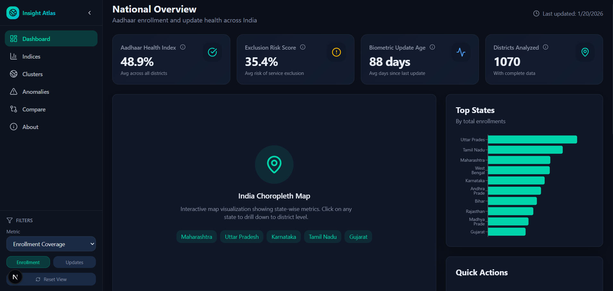
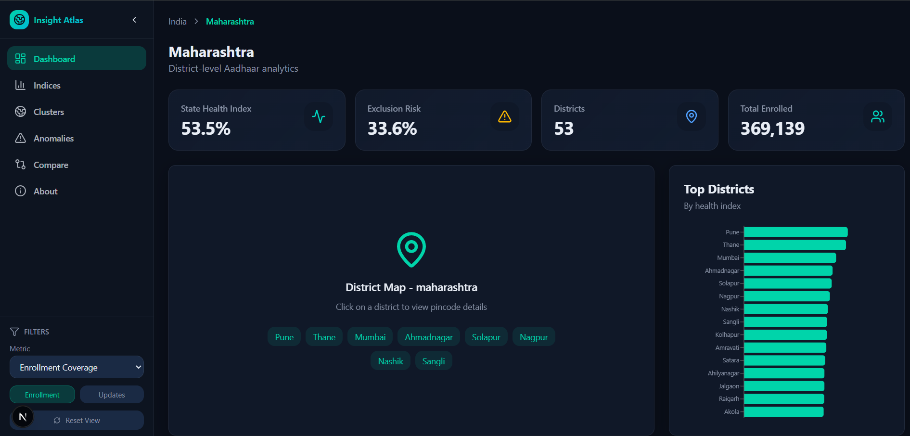
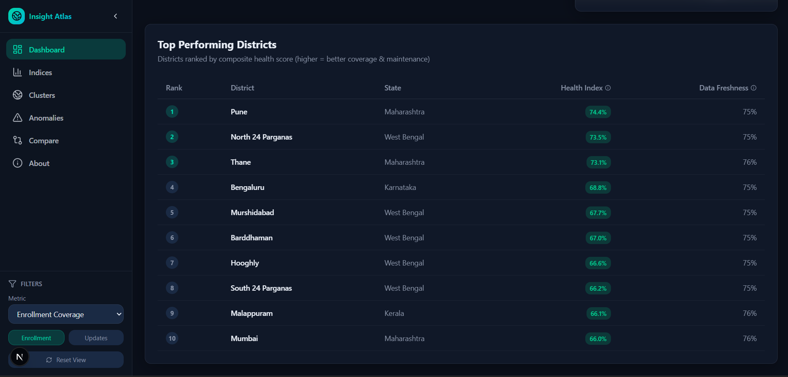
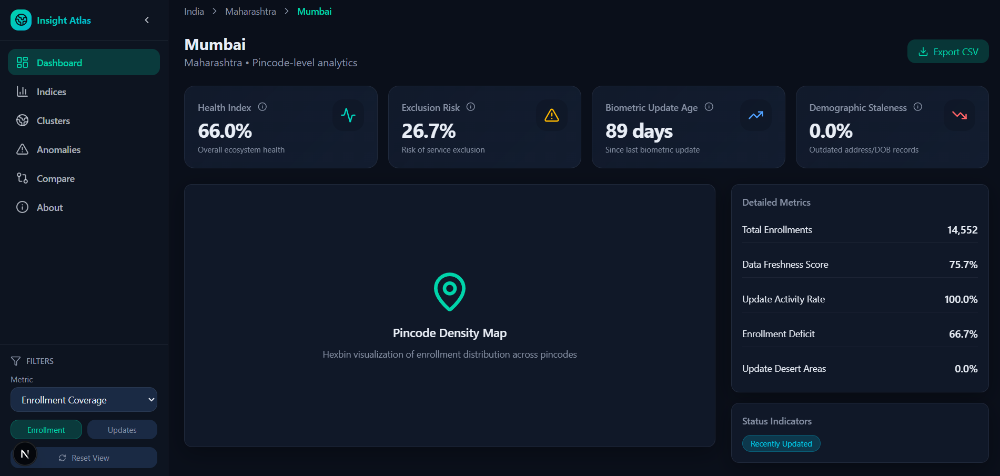
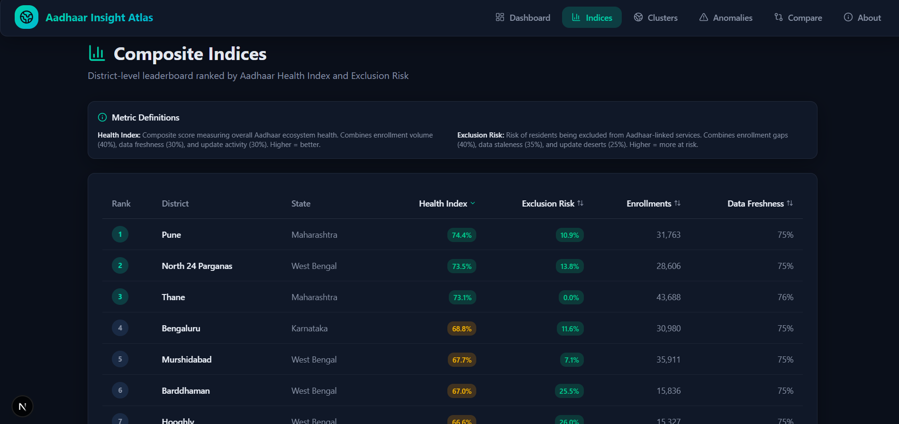
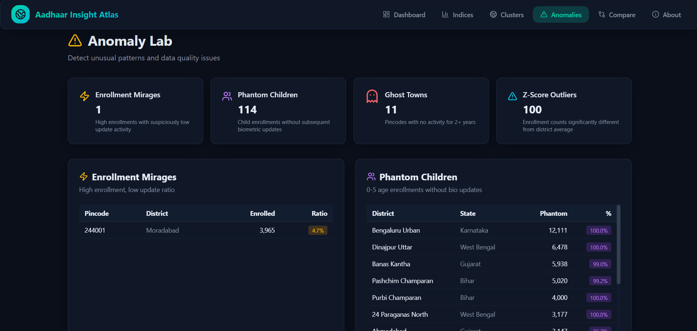
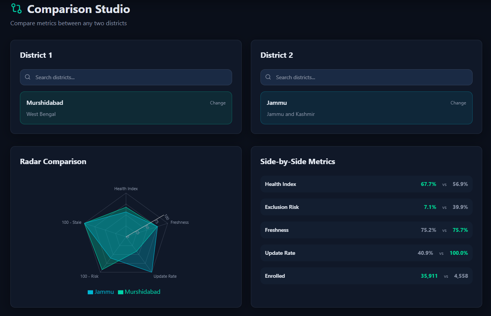
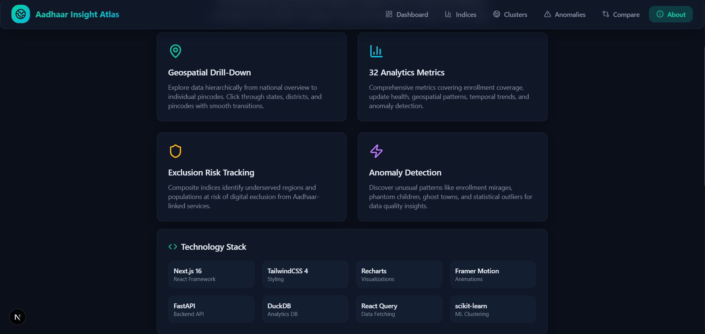

# Aadhaar Insight Atlas
## Unlocking Societal Trends in Aadhaar Enrolment and Updates

**Team ID: UIDAI_14057**
**Live Project Link: https://uidai-14057.vercel.app/**

---

## Problem Statement & Approach

**Challenge**: Identify meaningful patterns, trends, and anomalies from Aadhaar enrollment/update datasets to support informed decision-making.

**Solution**: **Aadhaar Insight Atlas** – an interactive geospatial analytics platform featuring:

- **Multi-level Drill-Down**: National → State → District → Pincode
- **32+ Analytics Metrics** across 7 categories
- **Two Novel Composite Indices**:
  - **Health Index** = Enrollment (40%) + Freshness (30%) + Updates (30%)
  - **Exclusion Risk** = Deficit (40%) + Staleness (35%) + Update Deserts (25%)
- **ML-powered Clustering**: DBSCAN (cold zones) + KMeans (hot zones)

---

## Datasets Used

| Dataset | Key Columns |
|---------|-------------|
| **Enrollment** | `pincode`, `district`, `state`, `age_0_5`, `age_5_17`, `age_18_greater`, `date` |
| **Biometric Updates** | `pincode`, `district`, `state`, `date`, `update_type` |
| **Demographic Updates** | `pincode`, `district`, `state`, `date`, `field_updated` |

---

## Methodology

1. **Data Loading**: DuckDB for high-performance analytics
2. **Preprocessing**: Null handling, date normalization, geographic hierarchy validation
3. **Feature Engineering**: Composite indices, clustering features, anomaly scores
4. **ML Models**: DBSCAN for cold clusters, KMeans for hot clusters, Z-score for outliers

---

## Key Findings

| Analysis | Finding |
|----------|---------|
| **Enrollment Distribution** | Top 10% districts account for majority of enrollments |
| **Health vs Risk Correlation** | Strong negative correlation validates complementary indices |
| **Geospatial Clustering** | Cold clusters reveal infrastructure gaps in specific regions |
| **Anomaly Detection** | Identified phantom children, ghost towns, enrollment mirages |

---

## Impact & Applicability

| Insight | Policy Application |
|---------|-------------------|
| **Exclusion Risk Index** | Prioritize enrollment camps in high-risk districts |
| **Phantom Children** | Mandate biometric update compliance for child Aadhaar |
| **Ghost Towns** | Infrastructure review for inactive pincodes |
| **Cold Clusters** | Regional equity programs for underserved areas |

**Tech Stack**: Next.js 16, TailwindCSS, Recharts, FastAPI, DuckDB, scikit-learn

---

## Platform Screenshots

### 1. National Dashboard

**Route**: `/dashboard` | Shows national-level Health Index, Exclusion Risk, Biometric Update Age, Districts Analyzed, top states chart, and top-performing districts leaderboard.

---

### 2. State Dashboard

**Route**: `/dashboard/state/[state]` | State-level drill-down with district-wise health scores, exclusion risk averages, and clickable district navigation.

---

### 3. Districts Table

**Route**: `/dashboard/state/[state]` | Comprehensive district metrics table with color-coded indicators for quick comparison.

---

### 4. District Dashboard

**Route**: `/dashboard/district/[district]` | Deep-dive metrics: Freshness Score, Update Rate, Enrollment Deficit, Update Desert Areas, and status badges.

---

### 5. Composite Indices

**Route**: `/indices` | District ranking by Health Index and Exclusion Risk with metric definitions and drill-down links.

---

### 6. Anomaly Lab

**Route**: `/anomalies` | Detects enrollment mirages, phantom children (0-5 age without updates), ghost towns (2+ years inactive), and bulk enrollment days (3σ+ outliers).

---

### 7. Cluster Explorer

**Route**: `/clusters` | ML-powered clustering identifying underserved regions (cold) and successful enrollment hubs (hot).

---

### 8. Comparison Studio

**Route**: `/compare` | Side-by-side district comparison with radar visualization across Health Index, Freshness, Update Rate, and Risk metrics.

---

### 9. About Page

**Route**: `/about` | Platform introduction, 4 key features, technology stack, and breakdown of 32+ metrics across 7 categories.

---

*Document prepared for UIDAI Data Analytics Challenge Submission*
